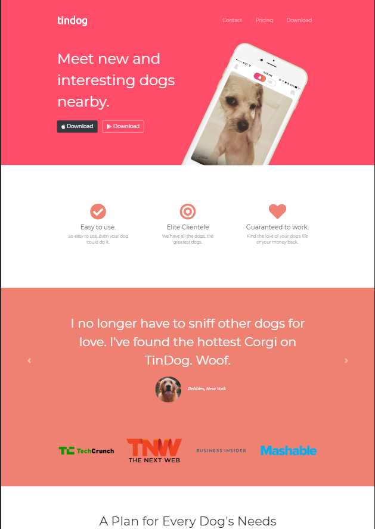

## Tindog
This is a project from an online course that I am taking to supplement and reinforce the coding that I learned at an in-class Full Stack bootcamp that I recently completed. This particular sample site was just too cute to just have it hidden in some subfolder of one of my repos so I transferred the files over to its own repo. 

This sample site reinforces the use of BootStrap and basic CSS to achieve a simple yet elegantly designed website that can easily meet the needs of most businesses today. Below is an image of what this website renders as: 

### Deployment
This sample site can be found at:
https://lokisixonenine.github.io/tindog/

### Notes:
* Due to the fact that this is a mock site, the site does have some Bootstrap/JQuery functionality but there are no external links. 
* If you are looking for additional resources to learn more about full stack development or are like me, simply looking to make good use of your time by expanding your knowledge of full stack development, I highly recommend the Udemy course The Complete Full Stack Developer Bootcamp by Angela Yu. 
* Full disclosure - I have no affiliation with Udemy or with Angela Yu other than the fact that her lessons and her methodology for teaching are easy to grasp and make complete sense to both seasoned and new coders alike. 
